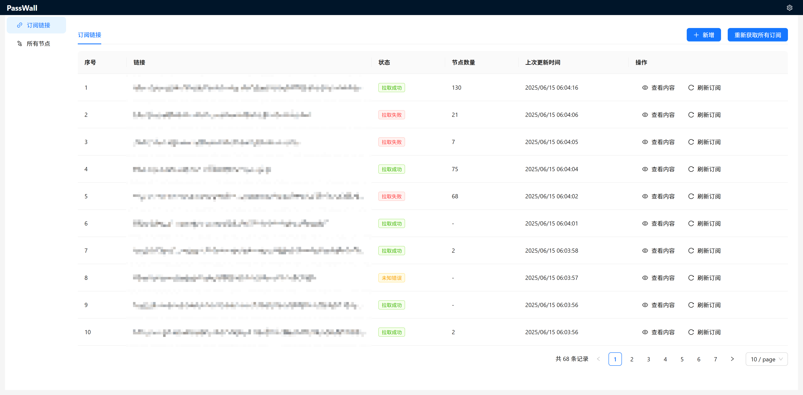
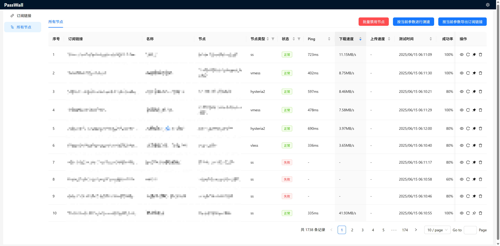
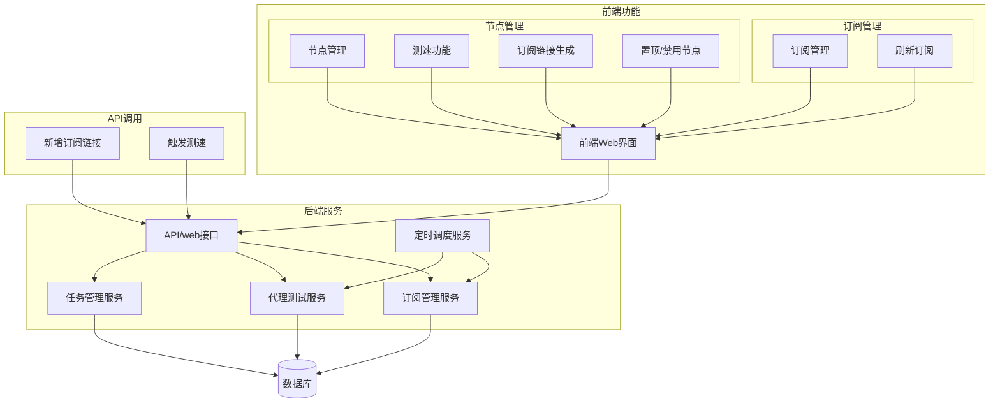

# PassWall

PassWall 是一个功能强大的代理服务器管理工具，支持多种代理协议、自动测速、定时任务和订阅管理。提供了直观的Web界面和灵活的API，让你轻松管理和使用各类代理服务器。

## 界面预览

### 订阅管理



### 节点管理



## 功能特点

### 1. 多协议支持

- VMess、VLess、SS、SSR、Trojan、Socks5等多种协议
- Hysteria、Tuic、WireGuard等新型协议

### 2. 订阅管理

- 支持导入多种格式的订阅源
  - Clash配置文件
  - V2ray/Xray配置文件
  - 原始配置（vless、vmess、trojan等）
- 自动解析和管理节点信息

### 3. 测速能力

- 支持多线程并发测试
- 定时自动测试所有节点
- 单独测试节点
- 详细的速度测试（延迟、上传、下载速度）

### 4. 订阅生成

- 生成多种格式的订阅配置
  - Clash配置（规划中）
  - V2ray/Xray配置文件
  - 其他分享链接

### 5. 定时任务

- 灵活配置定时测试任务
- 支持多种测试模式（全部节点、失败节点、测速等）

## 使用指南

1. 访问Web界面：`http://localhost:8080`
2. 使用配置文件中设置的token进行登录
3. 在"订阅管理"页面导入订阅
4. 在"节点管理"页面查看和测试节点
5. 使用生成的订阅链接配置您的客户端

## 安装部署

## 配置文件说明

```yaml
concurrent: 30  # 全局默认并发数

server:
  address: "0.0.0.0:8080"  # 服务器监听地址

database:
  driver: "sqlite"  # 数据库类型
  dsn: "passwall.db"  # 数据库连接字符串

proxy:
  enabled: false  # 是否启用代理(仅在更新订阅时生效)
  url: "socks5://127.0.0.1:7890"  # 代理地址

# 多个定时任务同时运行的只能有一个，单个定时任务内子任务串行执行
cron_jobs: # 定时任务配置
  - name: "每6小时更新所有订阅"  # 任务名称
    schedule: "0 0 */6 * * *"  # Cron表达式
    reload_subscribe_config: true  # 是否重新加载订阅
    test_all: false  # 是否测试所有节点
    test_new: false  # 是否测试新节点
    test_failed: false  # 是否测试失败节点
    test_speed: false  # 是否测速
    concurrent: 1  # 定时任务并发数

  - name: "每6小时测试所有节点"
    schedule: "0 10 */6 * * *"
    reload_subscribe_config: false
    test_all: true
    test_new: false
    test_failed: false
    test_speed: false
    concurrent: 30
```

### 使用预构建镜像

```bash
# 拉取最新镜像
docker pull pakro888/passwall:latest

# 运行容器
docker run -d \
  --name passwall \
  -p 8080:8080 \
  -v $(pwd)/config.yaml:/app/config.yaml \
  -v $(pwd)/data:/app/data \
  pakro888/passwall:latest
```

### 使用Docker Compose

1. 创建`config.yaml`文件，配置您的服务参数
2. 运行以下命令启动服务：

```yaml
version: '3'

services:
  passwall:
    image: pakro888/passwall:latest
    container_name: passwall
    restart: unless-stopped
    ports:
      - "8080:8080"
    volumes:
      - ./config.yaml:/app/config.yaml
      - ./data:/app/data
    environment:
      - PASSWALL_TOKEN=your_token_here
      - CONFIG_PATH=/app/config.yaml
      - TZ=Asia/Shanghai
```

```bash
docker-compose up -d
```

### 本地构建步骤

#### 前置条件

- Go 1.24 或更高版本
- Node.js 16 或更高版本
- npm 或 yarn

#### 后端构建

1. 克隆仓库到本地

```bash
git clone https://github.com/whyfear/passwall.git
cd passwall
```

2. 创建配置文件

```bash
cp config.yaml.example config.yaml
```

3. 编辑配置文件，根据需要修改配置

```bash
# 使用你喜欢的编辑器编辑配置文件
vim config.yaml

# 随后在环境变量中，写入token，不同系统操作不同，请自行搜索
export PASSWALL_TOKEN=your_token_here
```

4. 构建并运行后端

```bash
cd passwall
go mod tidy
go build -o passwall-server ./cmd/server
./passwall-server
```

#### 前端构建

1. 进入前端目录

```bash
cd web
```

2. 安装依赖

```bash
npm install
# 或者使用 yarn
yarn install
```

3. 开发模式运行

```bash
npm start
# 或者使用 yarn
yarn start
```

4. 构建生产版本

```bash
npm run build
# 或者使用 yarn
yarn build
```

5. 构建完成后的前端文件会生成在 `web/build` 目录下，可以通过后端服务访问

#### 整体构建和运行

完整的构建和运行过程（后端将自动提供前端静态文件）:

```bash
# 1. 构建前端
cd web
npm install && npm run build
cd ..

# 2. 构建后端
cd passwall
go mod tidy
go build -o passwall-server ./cmd/server

# 3. 运行服务
./passwall-server
```

构建完成后，访问 `http://localhost:8080` 即可使用PassWall。

## 系统架构

### 整体架构



## API接口

### 公共API

- `POST /api/create_proxy` - 创建代理节点/导入订阅
- `POST /api/test_proxy_server` - 触发节点测试
- `POST /api/stop_task` - 停止测试任务
- `GET /api/subscribe` - 获取订阅链接
- `POST /api/reload_subscription` - 重新加载订阅
- `GET /api/task_all_status` - 获取所有任务状态
- `GET /api/scheduler_status` - 获取调度器状态

### Web界面API

- `GET /web/api/subscriptions` - 获取所有订阅
- `GET /web/api/get_proxies` - 获取所有代理节点
- `GET /web/api/proxy/:id/history` - 获取节点历史测速记录
- `GET /web/api/get_types` - 获取所有代理类型
- `POST /web/api/pin_proxy` - 置顶/取消置顶节点
- `GET /web/api/get_task_status` - 获取指定任务状态

## 技术栈

- 后端：Go (Gin框架)
- 前端：React + Ant Design
- 数据库：SQLite
- 容器化：Docker

## 开发计划

- [ ] 支持更多订阅格式
- [ ] 优化测速算法
- [ ] 支持多种数据库

## 特别鸣谢

https://github.com/MetaCubeX/mihomo 提供的核心能力

https://github.com/faceair/clash-speedtest 项目提供的底层测速能力

## License

This software is released under the GPL-3.0 license.