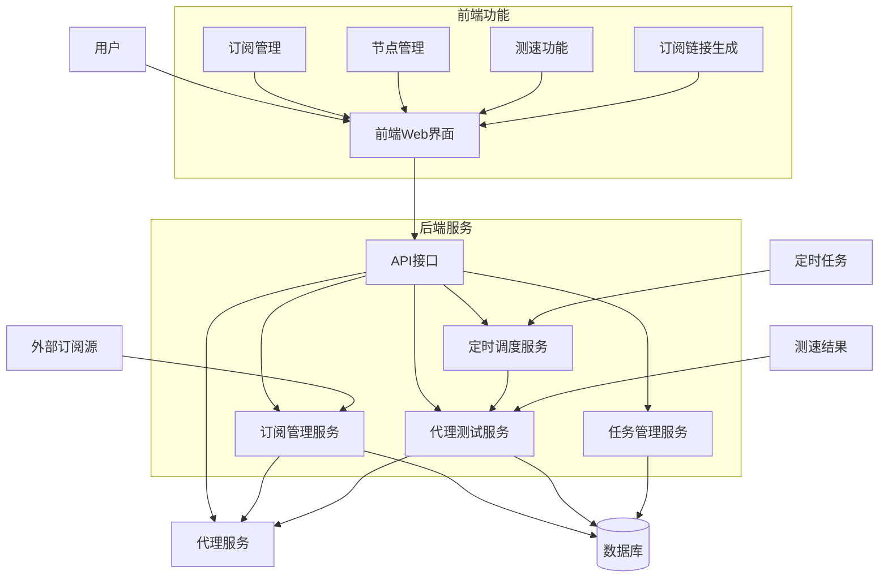
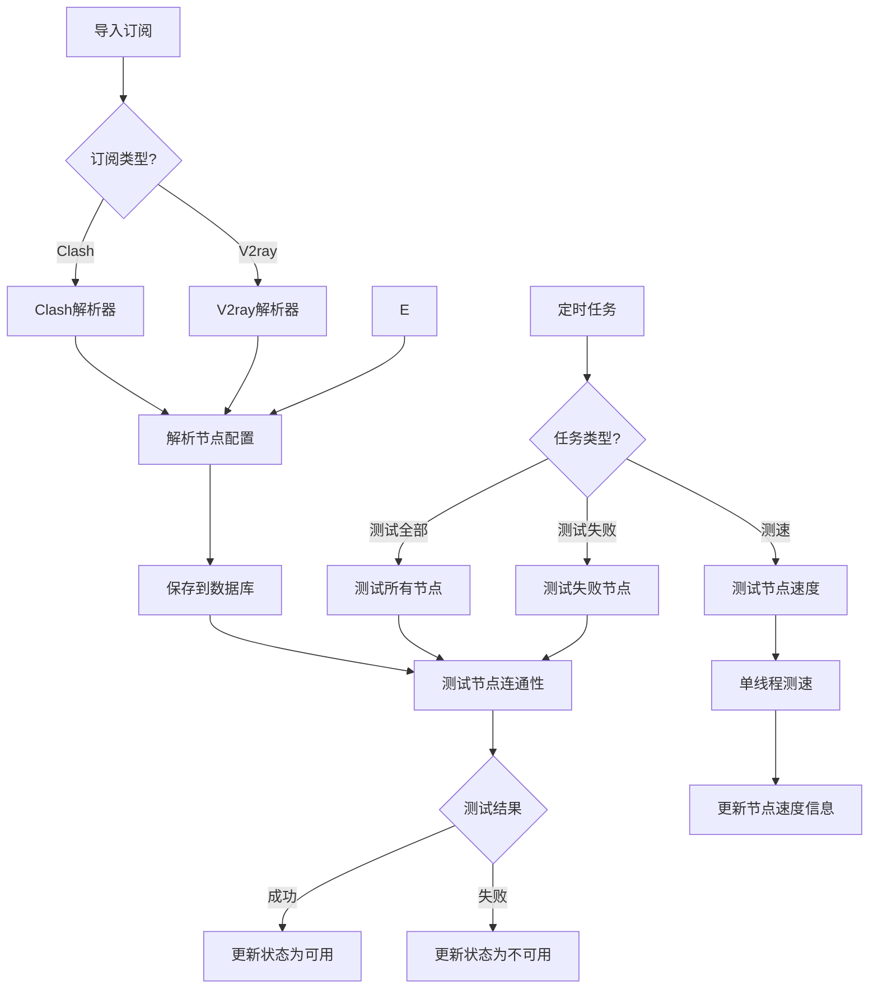
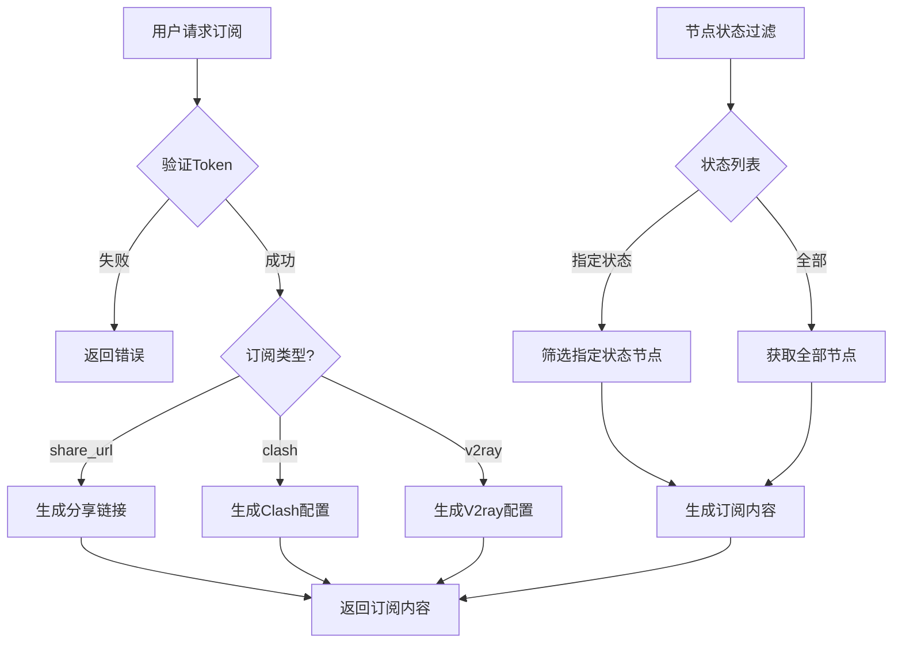

# PassWall

PassWall 是一个功能强大的代理服务器管理工具，支持多种代理协议、自动测速、定时任务和订阅管理。它提供了直观的Web界面和灵活的API，让您轻松管理和使用各类代理服务器。

## 使用指南

1. 访问Web界面：`http://localhost:8080`
2. 使用配置文件中设置的token进行登录
3. 在"订阅管理"页面导入订阅
4. 在"节点管理"页面查看和测试节点
5. 使用生成的订阅链接配置您的客户端

## 安装部署

## 配置文件说明

```yaml
token: "your_token"  # API访问令牌
concurrent: 30  # 默认并发数

server:
  address: "0.0.0.0:8080"  # 服务器监听地址

database:
  driver: "sqlite"  # 数据库类型
  dsn: "passwall.db"  # 数据库连接字符串

proxy:
  enabled: false  # 是否启用代理
  url: "socks5://127.0.0.1:7890"  # 代理地址

cron_jobs: # 定时任务配置
  - name: "每6小时测试所有节点"  # 任务名称
    schedule: "0 0 */6 * * *"  # Cron表达式
    reload_subscribe_config: true  # 是否重新加载订阅
    test_all: true  # 是否测试所有节点
    test_new: false  # 是否测试新节点
    test_failed: false  # 是否测试失败节点
    test_speed: false  # 是否测速
    concurrent: 30  # 并发数

  - name: "每天凌晨3点测试节点速度"
    schedule: "0 0 3 * * *"
    reload_subscribe_config: false
    test_all: false
    test_new: false
    test_failed: false
    test_speed: true
    concurrent: 1
```

### 使用预构建镜像

```bash
# 拉取最新镜像
docker pull pakro888/passwall:latest

# 运行容器
docker run -d \
  --name passwall \
  -p 8080:8080 \
  -v $(pwd)/config.yaml:/app/config.yaml \
  -v $(pwd)/data:/app/data \
  pakro888/passwall:latest
```

### 使用Docker Compose

1. 创建`config.yaml`文件，配置您的服务参数
2. 运行以下命令启动服务：

```yaml
version: '3'

services:
  passwall:
    image: pakro888/passwall:latest
    container_name: passwall
    restart: unless-stopped
    ports:
      - "8080:8080"
    volumes:
      - ./config.yaml:/app/config.yaml
      - ./data:/app/data
    environment:
      - CONFIG_PATH=/app/config.yaml
      - TZ=Asia/Shanghai
```

```bash
docker-compose up -d
```

## 功能特点

### 1. 多协议支持

- VMess、VLess、SS、SSR、Trojan、Socks5等多种协议
- Hysteria、Tuic、WireGuard等新型协议

### 2. 订阅管理

- 支持导入多种格式的订阅源
  - Clash配置文件
  - V2ray/Xray配置文件
  - 原始配置（vless、vmess、trojan等）
- 自动解析和管理节点信息

### 3. 测速能力

- 支持多线程并发测试
- 定时自动测试所有节点
- 单独测试失败节点
- 详细的速度测试（延迟、上传、下载速度）
- 支持多种测速工具：
  - Xray
  - Mihomo（支持多种协议）
  - Trojan

### 4. 订阅生成

- 生成多种格式的订阅配置
  - Clash配置
  - V2ray/Xray配置文件
  - 分享链接

### 5. 定时任务

- 灵活配置定时测试任务
- 支持多种测试模式（全部节点、失败节点、测速等）

## 系统架构

### 整体架构



### 订阅处理流程



### 订阅生成流程



## 数据库设计

### 代理节点表 (Proxy)

| 字段名              | 类型       | 说明           |
|------------------|----------|--------------|
| id               | uint     | 主键           |
| subscription_id  | uint     | 订阅ID (外键)    |
| name             | string   | 节点名称         |
| domain           | string   | 域名/IP        |
| port             | int      | 端口           |
| type             | string   | 代理类型         |
| config           | string   | 节点配置(JSON格式) |
| ping             | int      | 延迟(ms)       |
| download_speed   | int      | 下载速度(KB/s)   |
| upload_speed     | int      | 上传速度(KB/s)   |
| status           | int      | 状态           |
| pinned           | bool     | 是否置顶         |
| latest_test_time | datetime | 最近测试时间       |
| created_at       | datetime | 创建时间         |
| updated_at       | datetime | 更新时间         |

### 订阅表 (Subscription)

| 字段名        | 类型       | 说明        |
|------------|----------|-----------|
| id         | uint     | 主键        |
| url        | string   | 订阅URL/文件名 |
| content    | string   | 订阅内容      |
| type       | string   | 订阅类型      |
| status     | int      | 状态        |
| created_at | datetime | 创建时间      |
| updated_at | datetime | 更新时间      |

### 测速历史表 (SpeedTestHistory)

| 字段名            | 类型       | 说明         |
|----------------|----------|------------|
| id             | uint     | 主键         |
| proxy_id       | uint     | 代理ID (外键)  |
| ping           | int      | 延迟(ms)     |
| download_speed | int      | 下载速度(KB/s) |
| upload_speed   | int      | 上传速度(KB/s) |
| test_time      | datetime | 测试时间       |


## API接口

### 公共API

- `POST /api/create_proxy` - 创建代理节点/导入订阅
- `POST /api/test_proxy_server` - 触发节点测试
- `POST /api/stop_task` - 停止测试任务
- `GET /api/subscribe` - 获取订阅链接
- `POST /api/reload_subscription` - 重新加载订阅
- `GET /api/task_all_status` - 获取所有任务状态
- `GET /api/scheduler_status` - 获取调度器状态

### Web界面API

- `GET /web/api/subscriptions` - 获取所有订阅
- `GET /web/api/get_proxies` - 获取所有代理节点
- `GET /web/api/proxy/:id/history` - 获取节点历史测速记录
- `GET /web/api/get_types` - 获取所有代理类型
- `POST /web/api/pin_proxy` - 置顶/取消置顶节点
- `GET /web/api/get_task_status` - 获取指定任务状态


## 技术栈

- 后端：Go (Gin框架)
- 前端：React + Ant Design
- 数据库：SQLite
- 容器化：Docker

## 开发计划

- [ ] 支持更多订阅格式
- [ ] 优化测速算法

## 特别鸣谢

https://github.com/MetaCubeX/mihomo 提供的核心能力

https://github.com/faceair/clash-speedtest 项目提供的测速支持

## License

This software is released under the GPL-3.0 license.