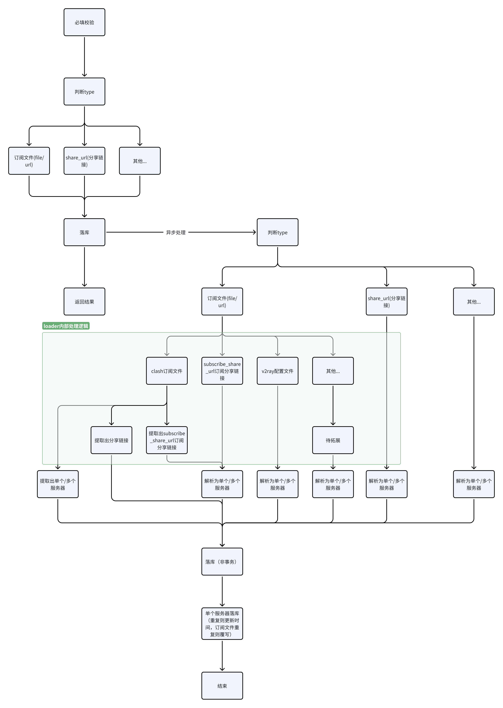

## 三大功能

**导入服务器配置/订阅源：**

1. clash订阅配置文件
2. v2ray/xray订阅配置文件
3. raw配置（vless、vmess、trojan）
4. 其他

**测速能力，支持定时测试，调用接口触发测试**

1. xray
2. mihomo（支持多种协议）
3. trojan

**提供多种订阅配置**

1. clash
2. v2ray/xray配置文件

## 配置文件设计

```YAML
token: "123"   # 获取订阅链接时，token必填
cron_jobs:
  - name: "想写啥写啥，给自己看的"
    schedule: "*/5 * * * * *"
    reload_subscrib_config: true
    test_all: true
    test_failed: true
    test_speed: true
    concurrent: 5
  - name: "可以每天定时单线程测速，注意同时只能运行一个任务"
    schedule: "*/5 * * * * *"
    reload_subscrib_config: false
    test_all: false
    test_failed: false
    test_speed: true
```

## 接口设计

### 创建订阅源

**path: create_proxy**

method: post

入参

| 入参 | 格式       | 是否必填                             | 示例                                                     |
| ------ | ------------ | -------------------------------------- | ---------------------------------------------------------- |
| url  | string     | 与file二选一必填，二者都填以file为准 | socks://Og\=\=@dsm.893843891.xyz:7890#DSM-mihomo<br /> |
| file | 二进制文件 | 与url二选一必填，二者都填以file为准  | 二进制文件。<br />                                           |
| type | string     | 必填                                 | clash、v2ray、trojan                                     |

出参

| 参数            | 格式   | 示例          |
| ----------------- | -------- | --------------- |
| result          | string | success、fail |
| status\_code | int    | 200、400等    |
| status\_msg  | string | OK            |

流程图



### 触发测速

**path: test_proxy_server**

method: post/get

入参：

任务提交后会异步运行，同时运行的测速任务只能有一个，如果有在进行中的任务，会返回失败

| 参数                           | 格式          | 是否必填 | 示例                                                                      |
| -------------------------------- | --------------- | ---------- | --------------------------------------------------------------------------- |
| reload\_subscrib\_config | bool          | 否       | 默认为false，为true则会重新处理所有订阅配置文件                           |
| test\_all                   | bool          | 否       | 默认为**true**，为true则会重新对所有节点多线程测速，参数优先级最高                |
| test\_failed                | bool          | 否       | 默认为false，为true则只对status\=2和3的节点多线程测速，参数优先级第二  |
| test\_speed                 | bool          | 否       | 默认为false，为true则对所有status\=1节点进行单进程测速，参数优先级第三 |
| concurrent                     | int（\>1） | 否       | 默认为5线程测速，test\_speed为true时不生效                             |

出参

| 参数            | 格式   | 示例                                                                                          |
| ----------------- | -------- | ----------------------------------------------------------------------------------------------- |
| result          | string | task\_running（有任务在运行），task\_submit(任务提交成功)，unknow\_error（未知错误） |
| status\_code | int    | 200、400等                                                                                    |
| status\_msg  | string | OK                                                                                            |

流程图


### 获取订阅链接

**path: subscribe**

Method: get

入参：

任务提交后会异步运行，同时运行的测速任务只能有一个，如果有在进行中的任务，会返回失败

| 参数   | 格式   | 是否必填 | 示例                                                     |
| -------- | -------- | ---------- | ---------------------------------------------------------- |
| token  | string | 是       | 配置文件中配置的token                                    |
| type   | string | 否       | share\_url、clash、v2ray。默认为share\_url分享链接 |
| status | list   | 否       | [0,1,2] 返回指定状态的服务器                             |

出参：

成功时返回订阅链接/文件内容

失败时，返回status\_code+status\_msg

## 定时任务设计

参考：https://space.coze.cn/s/70L2IPu2UkY/

执行时调用触发测速接口

## 数据库设计

### 主表：单节点数据库设计，联合主键（ip/domin+port）

| **id** | **subscribe_url_id**                                                        | **ip/domin** | **port** | **proxy_type**<br />    | **config(节点配置)** | **ping** | **download_speed** | upload\_speed | **status** | **latest_test_time** | **create_time** | **update_time** |
| -- | --------------------------------------------------------- | -- | -- | ------- | -- | -- | -- | ------------------ | -- | -- | -- | -- |
|  | 不一定有值                                              |  |  | ss    |  |  |  |                  |  |  |  |  |
|  | 如果subscribe\_url不同，但是节点相同，则覆写为最新的 |  |  | vless |  |  |  |                  |  |  |  |  |
|  |                                                         |  |  | sock5 |  |  |  |                  |  |  |  |  |

### 订阅链接的数据库设计（节点可能会更新）,主键subscribe\_url

| **id**  | **subscribe_url(配置文件链接)** |  | **status**<br />                        | **create_time**<br /> | **update_time** |
| --- | -- | -- | --------------------------- | ---- | -- |
| 1 |  |  | 0（待处理）               |    |  |
| 2 |  |  | 1（正常可拉取）           |    |  |
|   |  |  | 2（无法处理）             |    |  |
|   |  |  | 3（曾经可处理，现在失效） |    |  |

### 历史测速记录

| **id** | **proxy_id**         | **ping** | **download_speed** | upload\_speed | **test_time** |
| -- | ---------- | -- | -- | ------------------ | -- |
|  | 主表的id |  |  |                  |  |
|  |          |  |  |                  |  |

## 订阅status状态机设计


## 代理服务器status状态机设计


## 参考链接

https://wiki.metacubex.one/config/proxy-providers/content/#\_\_tabbed\_1\_1

https://linux.do/t/topic/683144